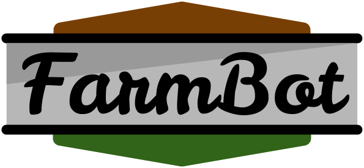
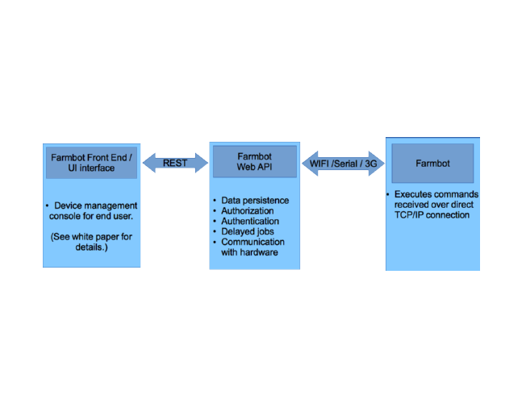

Farmbot Web API
===
RESTful JSON that runs the farm.

Usage
===

You will need to CURL for now. Eventually, there will be a Farmbot graphical frontend. API docs are on the way!

Pre-install Dependencies
===
1. [Install MongoDB](http://docs.mongodb.org/manual/installation/)
2. [Install Ruby 2.0](https://www.ruby-lang.org/en/downloads/)
2. [Install Rails4](http://rubyonrails.org/download)

We don't have a one step build yet. Sorry :(

Installation
===
 1. Clone this repo
 2. In terminal, `cd` into this projects root directory
 3. Install MongoDB and run it via `mongod`
 4. Set a secret token environment variable for the application (`export SECRET_TOKEN=STRONG_CRYPTOGRAPHIC_HASH`)
 5. `bundle install`
 6. `rails s`
 7. Visit `http://localhost:3000`. You should see the server running now.
 8. *PLEASE* submit an issue here if the installation does not work for you. We can't fix the things we don't know about.

How to Contribute
===
Pull requests welcome! Not sure where to start? We put all todo items for this repo in the issue tracker with a `todo: ` heading. If you clone the repo and run `rake notes` within the project, you may find other areas that are in need of refactoring.

Testing and Development
===
This project uses Rspec for testing. It also uses PhantomJS for integration testing. Make sure you have PhantomJS installed before you run the test suite via `rspec spec`.

Todo
===
 * One step installer / [docker container?](http://www.docker.io/learn_more/).
 * API docs
 * Codebase docs
 * Spin up a Heroku / AWS instance
 * Implement authorization via CanCan
 * Make a default login for non-technical users after installation
